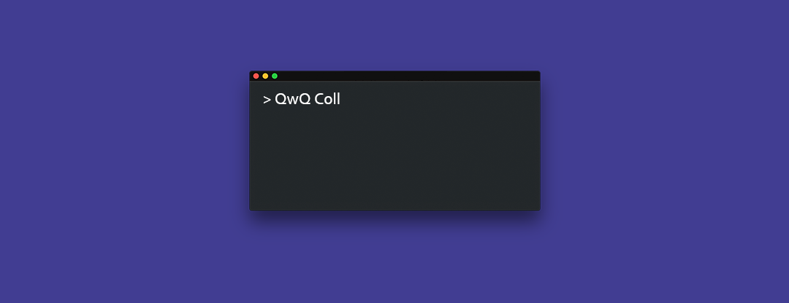
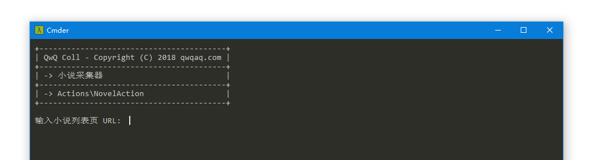
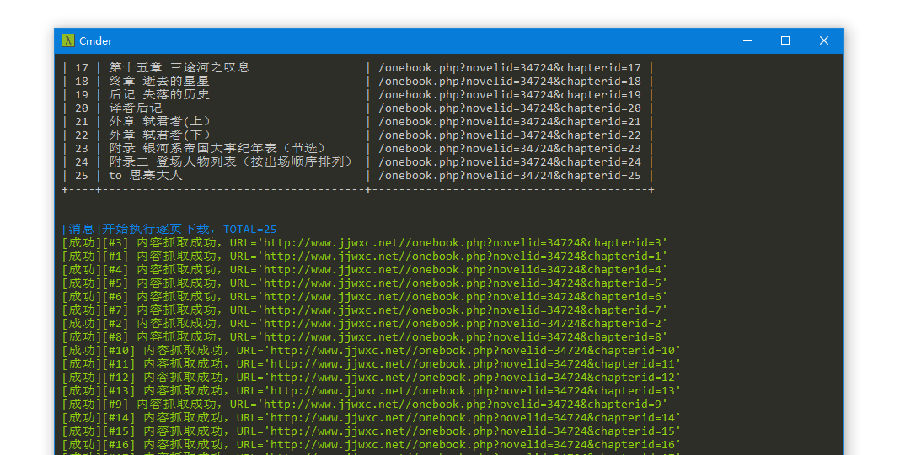

<p align="center">

</p>

# qwq-coll

一个轻量级爬虫框架 #(滑稽)，根据输入的 URL 自动选取自写的规则，然后执行采集任务。

一个支持 **自写规则** 的 **小说采集** 工具。

## 快速开始

```
git clone https://github.com/Zneiat/qwq-coll.git

cd src
composer install
cd ../

php -r "file_exists('config.php') || copy('config.example.php', 'config.php');"
php src/app.php 
```

## 目录结构

```
config.php               配置文件

src/Actions/             采集动作
src/Kernel/              核心功能
src/SupportProviders/    支援提供者

src/action-map.php       采集动作注册文件
src/app.php              程序入口文件
```

## 依赖

- [QueryList](https://github.com/jae-jae/QueryList)
    - [phpQuery](https://code.google.com/archive/p/phpquery/)
- [Guzzle](https://guzzlephp.org)

详见：[src/composer.json](src/composer.json)

## Action (采集动作)

写你的采集逻辑。运行程序会有一个列表(选择列表)列出 [已注册的 Action](#RegisterAction) 并提示选择 Action，然后执行你写的相应的采集逻辑。

- 存放目录：`src/Actions/`
- 文件名：`[动作名]Action.php`，使用驼峰命名法
- 示例：[src/Actions/ExampleAction.php](src/Actions/ExampleAction.php)

#### <span id="RegisterAction">怎么注册 Action？</span>

在创建新的 Action 后，需要到文件 [src/action-map.php](src/action-map.php) 中注册 Action，这样 Action 才会显示到 **选择列表** 中。

## SupportProvider (支援提供者)

根据 URL，获得相应的采集规则。每创建一个 Action 都需要同时创建一个 SupportProvider。

程序会在已选定 Action 后，让用户输入 URL(起始 URL)，然后在 SupportProvider 中尝试匹配，并获得相应的采集规则，供 Action 使用。

- 存放目录：`src/SupportProviders/`
- 文件名：`SupportProvider 文件名和创建的 Action 文件名一致`
- 示例：[src/SupportProviders/ExampleAction.php](src/SupportProviders/ExampleAction.php)

SupportProvider 文件存放的是一个数组：

```php
return [
    'https://github.com/topics/*' => [ // 支持通配符 *
        'coll_sel' => '.col-md-8 article h3.f3 .text-normal',
        // ...
        // 这里写自己的规则
    ],
    'https://github.com/*/*' => [
        'coll_sel' => '[itemprop="about"]',
        // ...
    ]
];
```

#### 怎么在 Action 中获取 Support？

例：`$this->support['coll_sel']`

程序在 Action 逻辑开始前，会将 **用户输入的 URL** 与 **SupportProvider 文件(数组) 中每项的 KEY(正则表达式)** 进行匹配，选定成功匹配的 **项（此数组称为 Support）**，然后导入这个 **Support** 到 `$this->support` 中。

## 内置函数

```php
_O('XXX'); // 普通输出
_I('XXX'); // 输出消息
_W('XXX'); // 输出警告
_E('XXX'); // 输出错误

getBaseUrl('https://github.com/Zneiat'); // "https://github.com"
getUrlPathAndQuery('https://github.com/Zneiat?test=yes'); // "/Zneiat?test=yes"

checkFilePath('xxx/downloads/filename.txt'); // 检测目录是否存在，若不存在则创建目录
fileNameStripBadStr('/*<标题>.txt', '#'); // "###标题#.txt"
```

[src/Kernel/Utils/utils.php](src/Kernel/Utils/utils.php)

[src/Kernel/Utils/console.php](src/Kernel/Utils/console.php)

## 截图





## Donate
如果您觉得我的项目对您有帮助，并且您愿意给予我一点小小的支持，您可以通过以下方式向我捐赠，这样可以维持项目持续地发展，非常感谢！ヽ(•̀ω•́ )ゝ

If you are enjoying this app, please consider making a donation to keep it alive.

| Alipay | Wechat | 
| :------: | :------: | 
|  |  | 

捐赠者的名字将保存于 [捐赠者列表](https://github.com/Zneiat/donate-qwqaq)，非常感谢你们的支持

## Author

**qwq-coll** © [qwqaq.com](https://qwqaq.com), Released under the [MIT](LICENSE) License.
